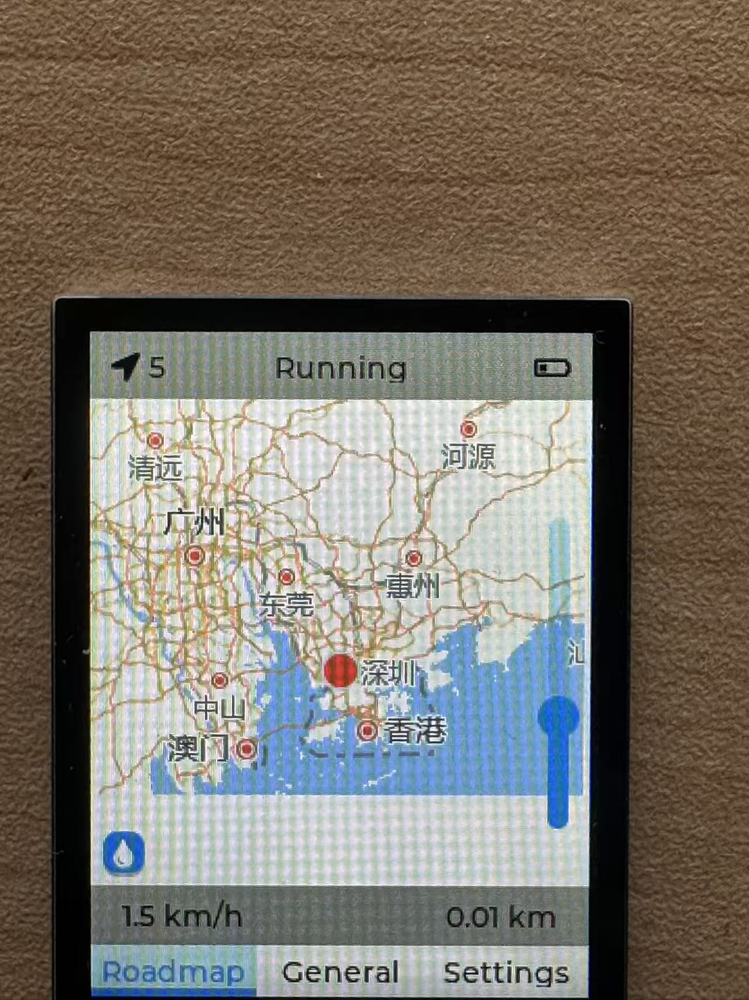
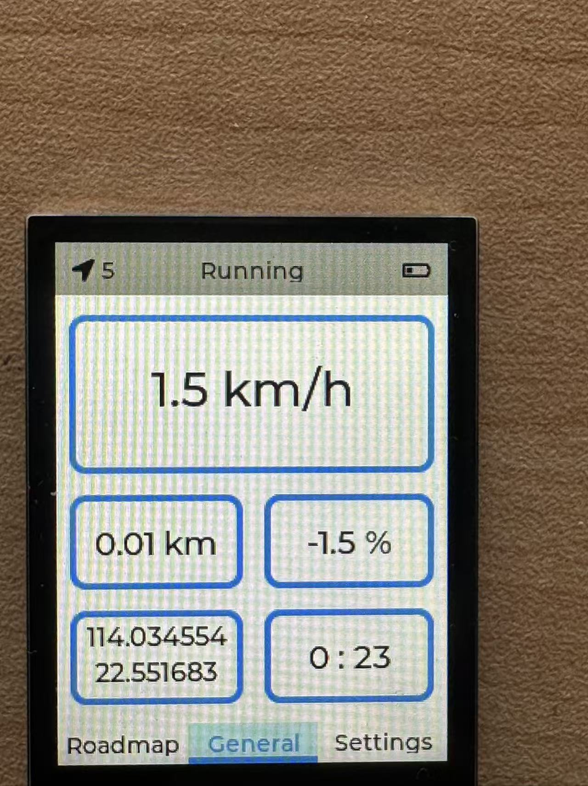
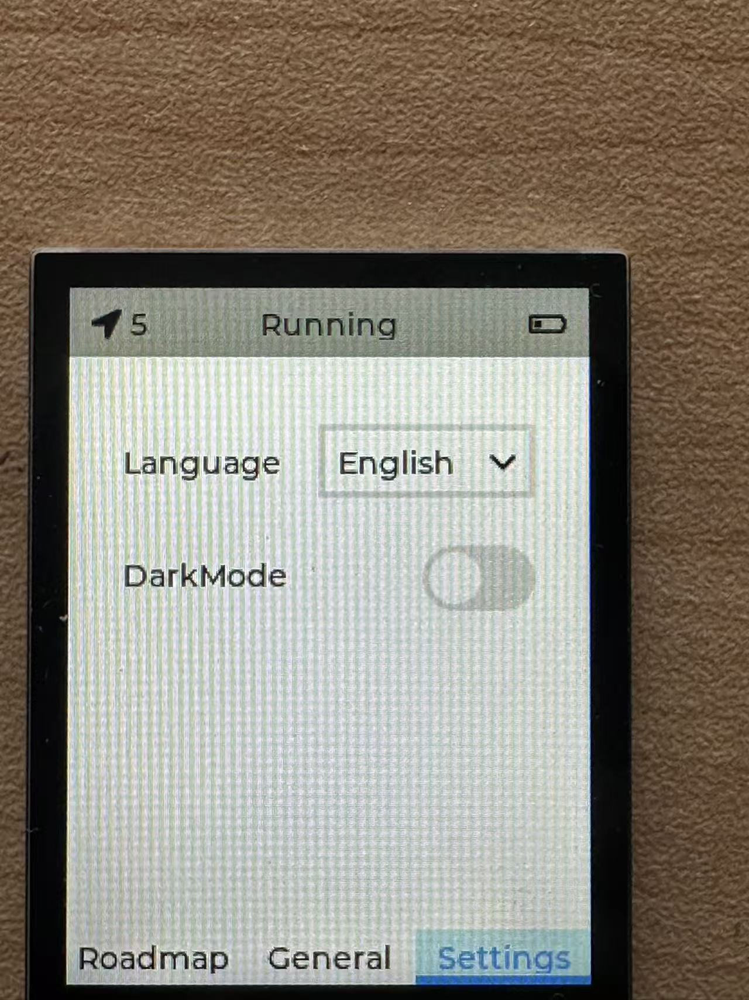

# STM32 Cycling Data Acquisition and Offline Map Terminal

[中文](README.md) | **English**

An embedded cycling data acquisition and offline map terminal built with **STM32F405RGT6, FreeRTOS and LVGL 9.4**. Its 240 × 320 touchscreen displays offline maps, GPS speed, accumulated distance, coordinates, moving time, estimated incline and battery status. The device includes Chinese/English interface options and light/dark display modes.

## Device Photos

| Roadmap | General | Settings |
| :---: | :---: | :---: |
|  |  |  |

## Features

- **GPS acquisition:** receives NMEA data over a serial port; parses GGA and VTG for coordinates, satellite count and speed. Includes map coordinate conversion code.
- **Ride statistics:** displays current speed, accumulated distance, moving time and motion status.
- **Offline maps:** loads BMP tiles from an SD card through FatFs into a 3 × 3 grid. Supports touch panning, zoom levels 3–14 and a recenter button.
- **Incline estimation:** uses LSM6DSM acceleration readings to estimate a percentage from device tilt.
- **Power and buttons:** battery voltage sampling, charging detection, battery icons, button scanning and a power-off callback.
- **Interface settings:** three pages for maps, ride data and settings, with Chinese/English options and light/dark display modes.

## Language Options

On the device, open **Settings → Language** and select **English** or **中文** to switch the translated page labels and settings text. The original firmware still displays the motion status as `Running / Stopped` in English.

This project also provides complete documentation in both languages. Select **中文** at the top of this page to open the Chinese introduction.

## Hardware and Software

| Component | Configuration |
| --- | --- |
| MCU | STM32F405RGT6 at 168 MHz |
| Display | ST7789, 240 × 320, SPI1 + DMA, 16-bit color |
| Capacitive touch | CST816 over I²C2 |
| GPS | Serial module emitting NMEA GGA / VTG, USART2 at 9600 baud |
| Inertial sensor | LSM6DSM over I²C1 |
| Storage | SDIO SD card with FatFs |
| Power monitoring | ADC1, charging-detection GPIO and power-control GPIO |
| RTOS and GUI | FreeRTOS / CMSIS-RTOS2, LVGL 9.4.0 and STM32 HAL |
| Development tools | Keil MDK-ARM and STM32CubeMX |

Refer to [`speed_meter.ioc`](speed_meter.ioc) and [`Core/Inc/main.h`](Core/Inc/main.h) for pin assignments. Schematics, PCB files and a complete hardware BOM are not included.

## Software Structure

[`Core/Src/freertos.c`](Core/Src/freertos.c) creates five tasks for the GUI, GPS, inertial sensor, power and buttons. The main task initializes LVGL, display and touch interfaces, mounts the SD card and runs the UI. Device tasks acquire data and update widgets through LVGL data binding and callbacks.

```text
.
├── application/ui/     # Pages, data model, translations and tile coordinates
├── interface/          # GPS, sensors, touch, buttons and power
├── Core/               # Main program, tasks and peripheral initialization
├── Drivers/            # CMSIS and STM32 HAL
├── Middlewares/        # LVGL, FreeRTOS, FatFs and other middleware
├── FATFS/              # SD card filesystem integration
├── USB_DEVICE/         # USB device configuration
├── MDK-ARM/            # Keil project and startup files
├── docs/images/        # Device photos
└── speed_meter.ioc     # CubeMX project configuration
```

## Build and Run

1. Clone the repository:

   ```bash
   git clone https://github.com/SCr7-gif/stm32-cycling-data-offline-map-terminal.git
   cd stm32-cycling-data-offline-map-terminal
   ```

2. Set up Keil MDK-ARM. The supplied project specifies **ARM Compiler 5.06 update 7 (build 960)** and **Keil.STM32F4xx_DFP 3.1.1**. The CubeMX configuration records **STM32Cube FW_F4 V1.28.3**.
3. Open [`MDK-ARM/speed_meter.uvprojx`](MDK-ARM/speed_meter.uvprojx), select the `speed_meter` target and run Build / Rebuild.
4. Check board power and peripheral connections. Configure your actual debugger and programming interface in Keil before flashing.
5. Prepare an SD card with offline map tiles, power on the device and check positioning and speed where GPS reception is available.

### Map Assets

The map code reads this LVGL path:

```text
C:/map/{zoom}/{x}/{y}/tile.bmp
```

`C:` is the FatFs logical drive registered with LVGL, not the Windows C drive. Place a `map` folder at the SD card root, for example `map/14/13372/7134/tile.bmp`.

Tiles must be **256 × 256 pixel BMP images**, cover the intended area and zoom levels, and match the coordinate system used by the code. **Map tiles and a download tool are not included; prepare these separately.**

## Project Notes

- This repository contains the device source code and dependencies, device photos and bilingual documentation. Original firmware behavior and third-party copyright notices are retained.
- Map functionality covers offline browsing and location display. The current source does not implement route planning, turn-by-turn navigation or GPX import/export.
- Distance, battery level and incline use the estimation methods in the supplied code and require calibration for the actual hardware.
- All 712 source-file references in the Keil project have been checked for existence. A full build, flashing and hardware retest were not performed during repository preparation. Device photos were supplied by the user.

## Third-Party Components

LVGL, FreeRTOS, STM32 HAL / CMSIS, FatFs and sensor drivers retain their respective licenses. Existing license files and copyright notices are preserved; no single new license has been applied to the entire repository.
